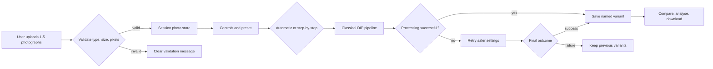
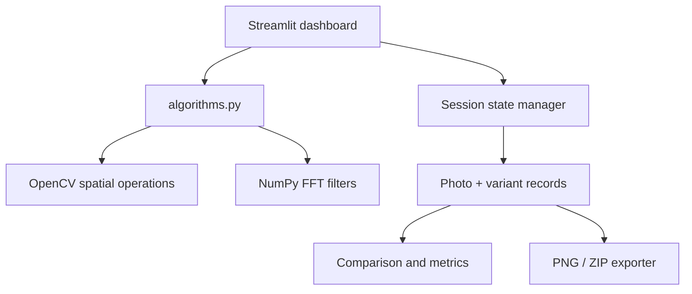
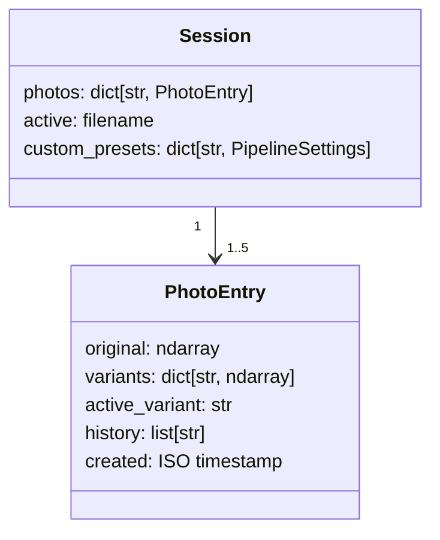

# System Design Diagrams

## Processing flow

```mermaid
flowchart LR
    U[User uploads 1-5 photographs] --> V{Validate type, size, pixels}
    V -->|valid| S[Session photo store]
    V -->|invalid| E[Clear validation message]
    S --> C[Controls and preset]
    C --> P{Automatic or step-by-step}
    P --> A[Classical DIP pipeline]
    A --> R{Processing successful?}
    R -->|yes| N[Save named variant]
    R -->|no| T[Retry safer settings]
    T --> F{Final outcome}
    F -->|success| N
    F -->|failure| K[Keep previous variants]
    N --> X[Compare, analyse, download]
```

## Component view

```mermaid
flowchart TB
    UI[Streamlit dashboard] --> State[Session state manager]
    UI --> Engine[algorithms.py]
    Engine --> OpenCV[OpenCV spatial operations]
    Engine --> FFT[NumPy FFT filters]
    State --> Photos[Photo + variant records]
    Photos --> Compare[Comparison and metrics]
    Photos --> Export[PNG / ZIP exporter]
```

## Per-photo state

```mermaid
classDiagram
    class PhotoEntry {
      original: ndarray
      variants: dict[str, ndarray]
      active_variant: str
      history: list[str]
      created: ISO timestamp
    }
    class Session {
      photos: dict[str, PhotoEntry]
      active: filename
      custom_presets: dict[str, PipelineSettings]
    }
    Session "1" --> "1..5" PhotoEntry
```
